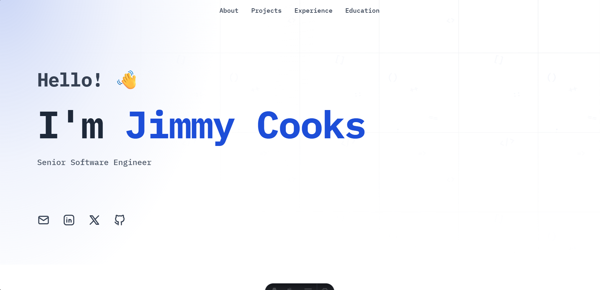

# DevPortfolio Template

A modern, minimalist portfolio template built with Astro and Tailwind CSS. Perfect for developers looking to showcase their skills, experience, and projects in a clean, professional way.

This was completely rebuilt from the ground up from V1. This template was built to be entirely ready to go with a quick config edit (see below) but also provides the ability to easily extend in whatever way you want.

This template also comes with `CLAUDE.md` and `.cursor/rules` files for easy integration with your existing AI workflows.

> **📬 Connect & Share!**  
> For questions and updates, feel free to reach out on [**X (Twitter)**](https://x.com/jimcooks211).  
> If you've built and published your personal site with this template, I'd love to see it! Send me a DM 🚀

## Preview

To view a live preview of the site, [click here](https://jimcooks21.github.io/devportfolio/
).

